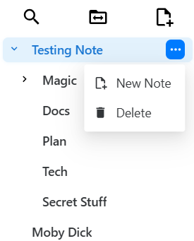
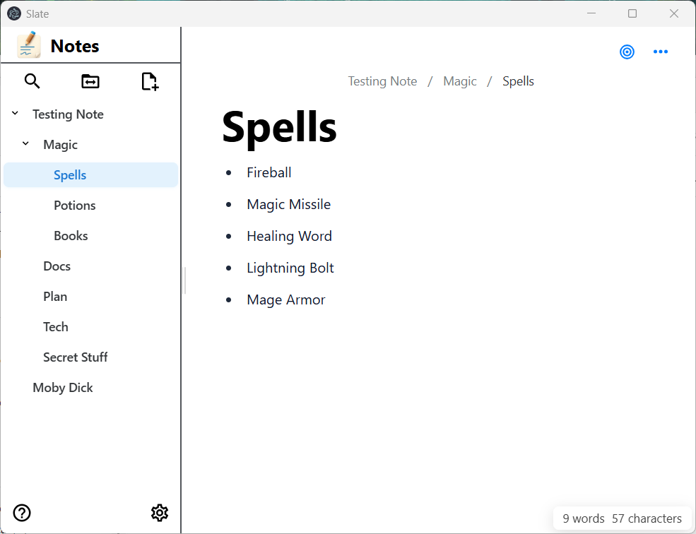
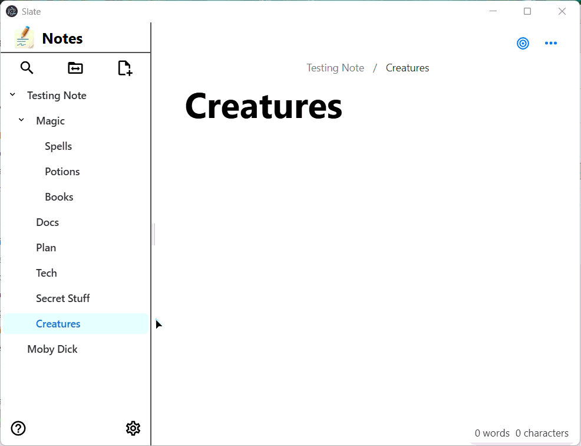
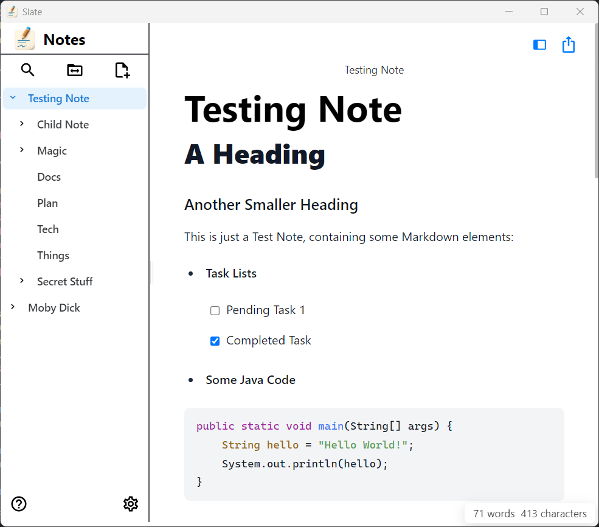
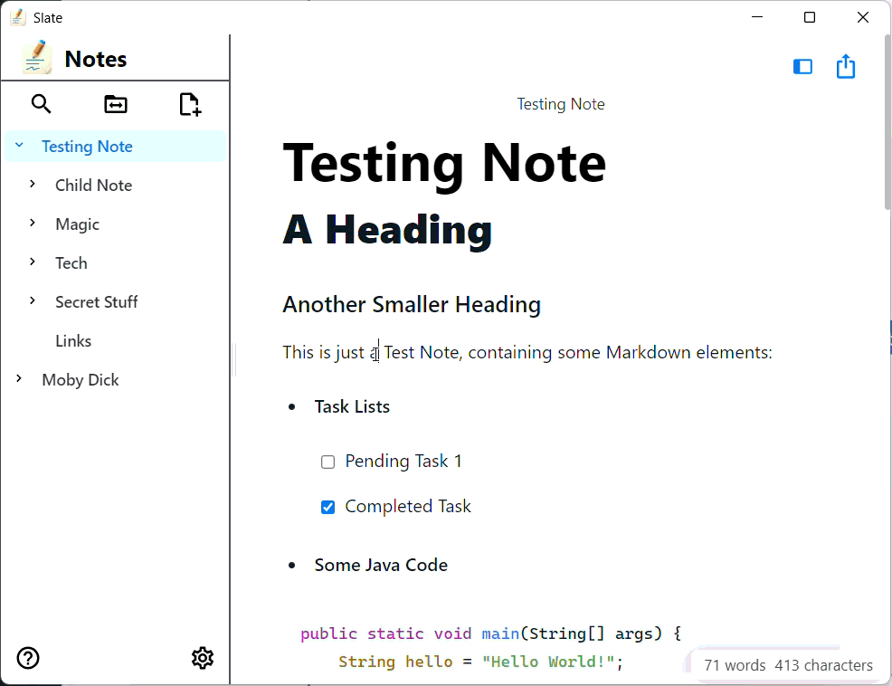
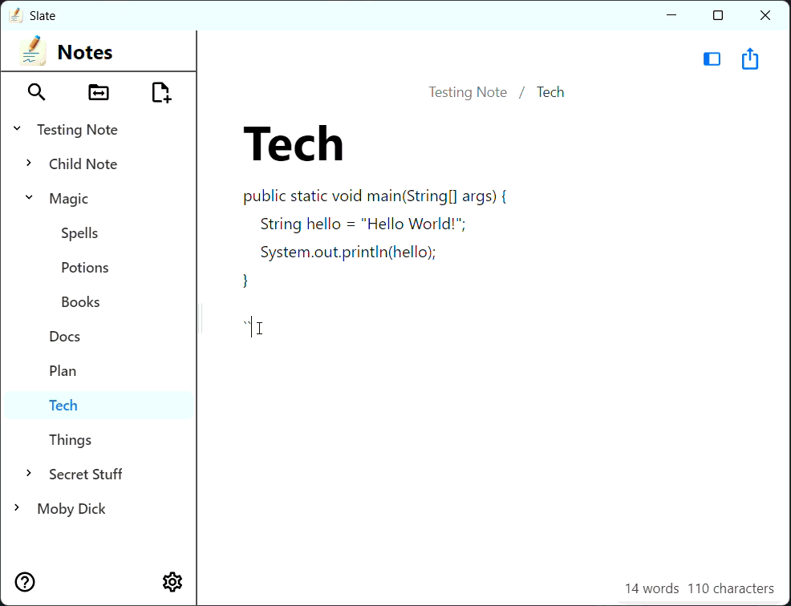
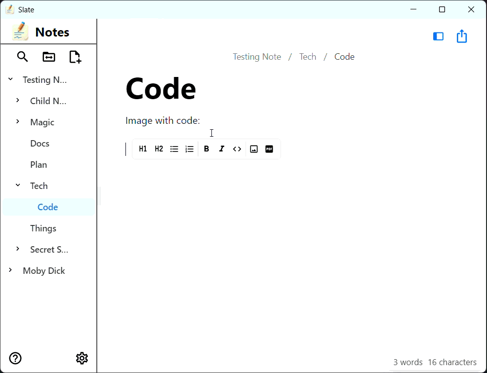
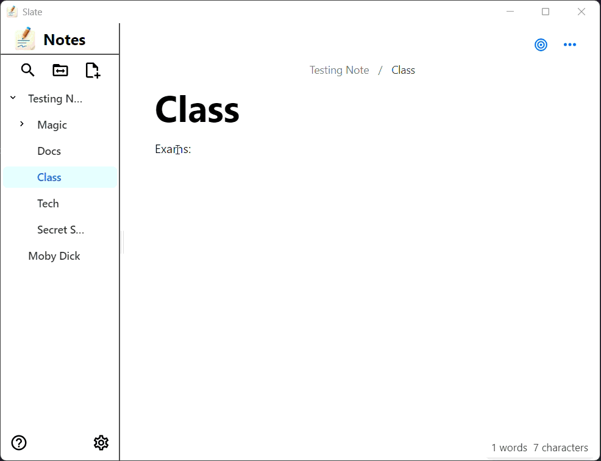
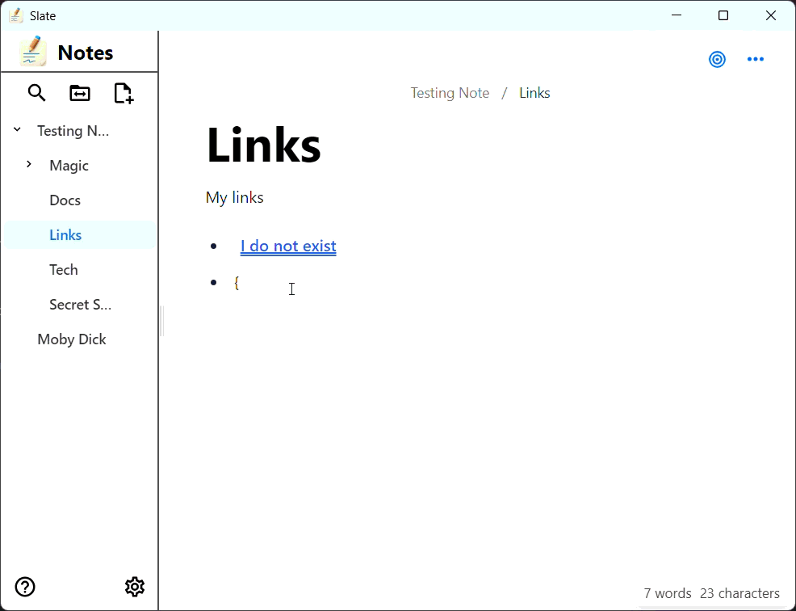
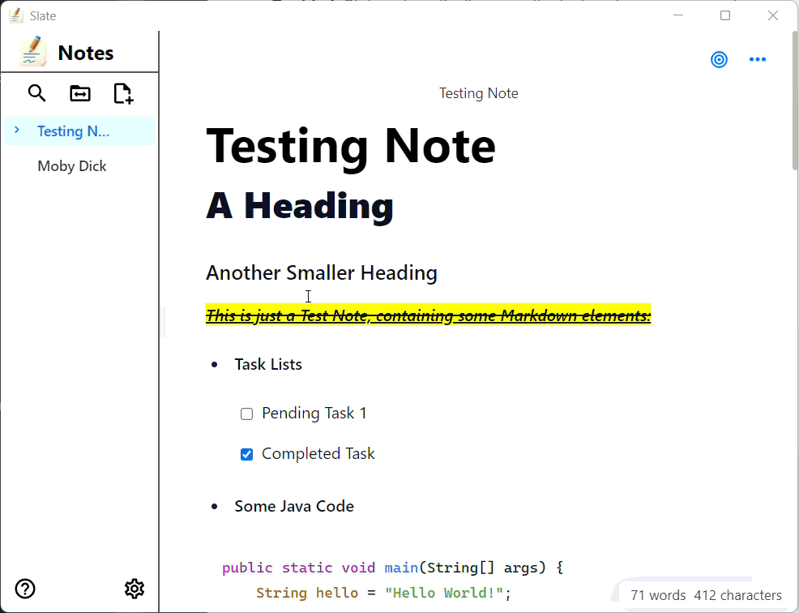

# Slate User Manual

## Table of Contents

- [1. What is Slate?](#1-what-is-slate)
- [2. Workspaces](#2-workspaces)
  - [2.1 Changing Workspaces](#21-changing-workspaces)
  - [2.2 Renaming a Workspace](#22-renaming-a-workspace)
  - [2.3 Deleting a Workspace](#23-deleting-a-workspace)
- [3. Working with Notes](#3-working-with-notes)
  - [3.1 Creating Notes](#31-creating-notes)
  - [3.2 Selecting and Viewing Notes](#32-selecting-and-viewing-notes)
  - [3.3 Hierarchical Organization](#33-hierarchical-organization)
  - [3.4 Renaming Notes](#34-renaming-notes)
  - [3.5 Moving Notes](#35-moving-notes)
  - [3.6 Deleting Notes](#36-deleting-notes)
  - [3.7 Searching Notes](#37-searching-notes)
- [4. The Editor](#4-the-editor)
  - [4.1 Editor Interface](#41-editor-interface)
  - [4.2 Text Formatting](#42-text-formatting)
  - [4.3 Working with Lists](#43-working-with-lists)
  - [4.4 Headings and Structure](#44-headings-and-structure)
  - [4.5 Code Blocks](#45-code-blocks)
  - [4.6 Undo and Redo](#46-undo-and-redo)
- [5. Multimedia Content](#5-multimedia-content)
  - [5.1 Inserting Images](#51-inserting-images)
  - [5.2 Embedding PDFs](#52-embedding-pdfs)
- [6. Linking Notes](#6-linking-notes)
- [7. Note Export](#7-note-export)
  - [7.1 Export Formats](#71-export-formats)
  - [7.2 Exporting Notes](#72-exporting-notes)
- [8. Focus Mode](#8-focus-mode)
  - [8.1 Enabling Focus Mode](#81-enabling-focus-mode)
- [9. Settings](#9-settings)
  - [9.1 Accessing Settings](#91-accessing-settings)
  - [9.2 Workspace Settings](#92-workspace-settings)
  - [9.3 Display Settings](#93-display-settings)
  - [9.4 Restoring Defaults](#94-restoring-defaults)
- [10. Keyboard Shortcuts](#10-keyboard-shortcuts)
  - [General](#general)
  - [Text Formatting](#text-formatting)
  - [Editing](#editing)
  - [Lists](#lists)
  - [Headings](#headings)

---

## 1. What is Slate?

Slate is a cross-platform desktop note-taking application designed to enhance your personal productivity. Built with simplicity and usability in mind, Slate provides a distraction-free environment for both writing and information management.

---

## 2. Workspaces

Workspaces in Slate are folders on your computer that contain your notes and related files. Each workspace is independent, allowing you to organize notes for different projects or ideas.

### 2.1 Changing Workspaces

1. Click the **Change workspace** button 📁 in the sidebar.
2. In the workspaces list, click the workspace card you want to open.

> **Note**: When changing workspaces, any unsaved changes in a note will be automatically saved before switching.

### 2.2 Renaming a Workspace

**To rename a workspace:**

1. Open the workspace selection dialog
2. Click the three-dot menu (⋯) on the workspace you want to rename
3. Click the **edit icon** (✏️)
4. Enter the new name
5. Click **Rename** or **Cancel** to discard changes

> **Important**: Renaming a workspace does not change the folder location on your computer.

### 2.3 Deleting a Workspace

**To remove a workspace from Slate:**

1. Open the workspace selection dialog
2. Hover over the workspace you want to delete
3. Click the **delete icon** (🗑️)
4. Confirm the deletion

> **Important**: Deleting a workspace only removes it from Slate's workspace list. Your notes and files remain on your computer in the original folder location.

---

## 3. Working with Notes

### 3.1 Creating Notes

There are several ways to create a new note in Slate:

**Method 1: Using the New Note Button**
1. Click the **"New Note"** button on the top right of the sidebar
2. A new note will be created at the root level and selected
 

**Method 2: Creating Sub-notes**
1. Click or hover over the three-dot menu (⋯) next to an existing note in the sidebar
2. Select **"New Note"** from the context menu
3. A new sub-note will be created inside the selected note

<p align="center">
  
</p>

### 3.2 Selecting and Viewing Notes

**To view a note:**
1. Click on the note name in the sidebar
2. The note content will appear in the editor panel on the right

**Breadcrumb Navigation:**
- At the top of the editor, you'll see a breadcrumb trail showing the note's location in the hierarchy
- Click any note name in the breadcrumb to navigate to that note

<p align="center">
  
</p>

### 3.3 Hierarchical Organization

Slate supports hierarchical note organization, allowing you to create notes inside other notes (sub-notes).

**Understanding the Hierarchy:**
- **Parent Notes**: Notes that contain other notes
- **Sub-notes**: Notes nested inside parent notes
- **Root Notes**: Top-level notes with no parent

**Expanding/Collapsing Notes:**
- Click the arrow icon (▶) next to a note to expand/collapse its sub-notes


> **Note**: This helps you keep your sidebar organized when working with many notes

### 3.4 Renaming Notes

**To rename a note:**

1. Click on the note name at the top of the editor panel
2. The name becomes editable
3. Type the new name

> **Tip**: Choose descriptive names that make it easy to find notes later.

### 3.5 Moving Notes

You can reorganize your notes by moving them within the hierarchy using drag and drop.

**To move a note:**

1. Click and hold on to the note you want to move
2. Drag it to the desired location:
   - **Inside another note**: Drop on the target note to make it a sub-note
   - **Before a note**: Drop in the space above a note
   - **After a note**: Drop in the space below a note
3. Release the mouse button to complete the move

> **Important**: You can move entire note hierarchies. When you move a parent note, all its sub-notes move with it.


<p align="center">
  
</p>

### 3.6 Deleting Notes

**To delete a note:**

1. Click or hover over the three-dot menu (⋯) next to an existing note in the sidebar
2. Select **"Delete"**
3. Confirm the deletion in the dialog box (not required if the note has no sub-notes)

> **Warning**: This action cannot be undone from within the application, but the files remain in your recycling bin/trash.

### 3.7 Searching Notes

The search functionality helps you quickly find notes by name.

**To search for notes:**

1. Click in the search box at the top of the sidebar
2. Type your search query
3. The sidebar will filter to show only matching notes
4. Click on a note in the results to open it

**Search Tip:** Clear the search box to show all notes again

---

## 4. The Editor

### 4.1 Editor Interface

The Slate editor uses a WYSIWYG (What You See Is What You Get) approach, meaning you see formatted text as you type.

**Editor Layout:**
- **Breadcrumb Bar**: Shows the note's position in the hierarchy
- **Bubble menu**: Access formatting options and editor actions
- **Content Area**: Where you write and edit your notes
- **Focus Mode Toggle**: Switch to distraction-free writing

<p align="center">
  
</p>

### 4.2 Text Formatting

Apply formatting to your text using the Bubble menu or keyboard shortcuts:

**Bold Text**
- Click the **B** button in the Bubble menu, or
- Select text and use the keyboard shortcut (`Ctrl+B` on Windows/Linux, `Cmd+B` on macOS)

**Italic Text**
- Click the **I** button in the Bubble menu, or
- Select text and use the keyboard shortcut (`Ctrl+I` on Windows/Linux, `Cmd+I` on macOS)

**Underline Text**
- Click the **U** button in the Bubble menu, or
- Select text and use the keyboard shortcut (`Ctrl+U` on Windows/Linux, `Cmd+U` on macOS)

**Strikethrough**
- Click the **S** button with a line through it, or
- Select text and use the keyboard shortcut (`Ctrl+Shift+X` on Windows/Linux, `Cmd+Shift+X` on macOS)

**Highlight**
- Select text and click the highlight button, or
- Use the keyboard shortcut (`Ctrl+E` on Windows/Linux, `Cmd+E` on macOS)
- Choose a highlight color if multiple options are available

**Inline Code**
- Format text as `code` using the code button or keyboard shortcut (`Ctrl+E` on Windows/Linux, `Cmd+E` on macOS)
<p align="center">
  
</p>

### 4.2.1 Markdown Links

You can create links to external web pages using standard Markdown syntax:

- **Syntax:** `[link text](url)`
- **Example:** `[Example website](https://example.com)`

You can also use the link button in the Bubble menu to insert links.

When you click on the link it will open in your default web browser.

### 4.3 Working with Lists

**Bullet Lists:**
1. Click the bullet list button in the Bubble menu, or
2. Type `- ` (dash and space) at the start of a line
3. Press **Enter** to create a new bullet point
4. Press **Tab** to indent (create nested lists)
5. Press **Shift+Tab** to outdent

**Numbered Lists:**
1. Click the numbered list button in the Bubble menu, or
2. Type `1. ` (number, period, space) at the start of a line
3. Press **Enter** to create the next numbered item
4. Press **Tab** to create nested numbered lists

**Task Lists:**
1. Click the Todo list button on the Bubble menu
2. Type your task
3. Click the checkbox to mark tasks as complete
4. Press **Enter** to add more tasks

> **Tip**: You can mix list types by using different types of lists within each other.

### 4.4 Headings and Structure

Use headings to organize your content into sections:

**Creating Headings:**
- Select the heading level from the Bubble menu dropdown (H1, H2, H3, etc.), or
- Type `#` followed by a space for H1, `##` for H2, `###` for H3, etc.

### 4.5 Code Blocks

For longer code snippets or preserving formatting:

**Creating a Code Block:**
1. Click the code block button in the Bubble menu, or
2. Type triple backticks (```) and press **Enter**
3. Type or paste your code
4. The code block preserves indentation and formatting

**Inline Code:**
- For short code snippets within text, use the inline code format with single backticks (`)

<p align="center">
  
</p>


### 4.6 Undo and Redo

**Undo:**
- Use `Ctrl+Z` (Windows/Linux) or `Cmd+Z` (macOS)

**Redo:**
- Use `Ctrl+Y` (Windows/Linux) or `Cmd+Shift+Z` (macOS)

> **Note**: The undo/redo history is maintained for the currently selected note. If you switch notes, the history for the previous note is removed.

---

## 5. Multimedia Content

All multimedia files (images and PDFs) are stored in the `.files` directory within your workspace folder:

```
Your Workspace Folder/
├── .notes/
└── .files/
    ├── image1.png
    ├── document.pdf
    └── photo.jpg
```

### 5.1 Inserting Images

Add images to your notes:

**To insert an image:**

**Method 1: Using the Bubble menu**
1. Click the **Image** button in the Bubble menu
2. Browse to select an image file (PNG, JPG, GIF, etc.)
3. The image will be inserted at your cursor position

**Method 2: Paste web image from Clipboard**
1. Copy an image link (URL) to your clipboard
2. Paste (`Ctrl+V` or `Cmd+V`) into the editor

<p align="center">
  
</p>

### 5.2 Embedding PDFs

View PDF documents directly within your notes:

**To embed a PDF:**

1. Click the **PDF** button in the Bubble menu
2. The PDF will be displayed in an embedded viewer

<p align="center">
  
</p>

---

## 6. Linking Notes

Link notes together to create connections and improve navigation:

**To create a note link:**

1. Type `[[Note Name]]` (double square brackets around the note name)
2. The link is automatically created

> **Note**: If the note does not exist, a new note with that name will be created when you click the link.


<p align="center">
  
</p>

---

## 7. Note Export

### 7.1 Export Formats

Slate supports exporting your notes to multiple formats:

| Format | Best For |
|--------|----------|
| **Plain Text** | Simple text backup, email |
| **Markdown** | Version control, other Markdown editors |
| **HTML** | Web viewing, sharing online |
| **PDF** | Printing, professional sharing, archiving |

### 7.2 Exporting Notes

**To export the current note:**

1. Make sure the note you want to export is open in the editor
2. Click the **More options** button (⋯) in the editor toolbar
3. Choose the export format:
   - Plain Text
   - Markdown
   - HTML
   - PDF
4. Select if you want to include all sub-notes in the export or just the current note
5. Click **Export**
6. Choose a save location
7. Click **Save**

The note is exported as a single file in your chosen format.

**Export Behavior:**
- Multiple notes are packaged as a ZIP file
- Each note becomes a separate file within the ZIP
- The `.files` folder is included

**File Structure Example:**
```
ExportedNote.zip
├── ExportedNote.md
├── SubNote1.md
├── SubNote2.md
└── .files/
    ├── image1.png
    └── document.pdf
```
---

## 8. Focus Mode

### 8.1 Enabling Focus Mode

Focus Mode provides a distraction-free writing environment by hiding the sidebar and minimizing interface elements.

**To enable Focus Mode:**
1. Click the **Focus Mode** button (🎯) in the editor toolbar
2. The sidebar disappears, giving you more space to write

**To Exit Focus Mode:**
- Click the **Exit Focus Mode** button (🎯)

<p align="center">
  
</p>

---

## 9. Settings

### 9.1 Accessing Settings

**To open Settings:**

1. Click the **Settings** icon (gear/cog) in the bottom-left corner of the sidebar

### 9.2 Workspace Settings

**Remember Last Workspace**
- **Enabled**: Slate automatically opens the last workspace you used
- **Disabled**: You'll see the workspace selection screen on each launch

**Remember Last Note**
- **Enabled**: When opening a workspace, Slate selects the last note you were editing
- **Disabled**: No note is selected when opening a workspace

### 9.3 Display Settings

**Sub-notes Display Type**

Controls how sub-notes are displayed in the editor:

- **Default**: Shows the first 5 sub-notes as large icons, then switches to small icons for the rest
- **Big Only**: All sub-notes are shown as large
- **Small Only**: All sub-notes are shown as compact list items
- **None**: Sub-notes are hidden when editing


### 9.4 Restoring Defaults

If you want to reset all settings to their original values:

1. Open **Settings**
2. Click the **Restore Defaults** button
3. Confirm the action
4. Click **OK**
 
<p align="center">
  
</p>

---

## 10. Keyboard Shortcuts

### Text Formatting

| Action | Windows/Linux | macOS |
|--------|---------------|-------|
| Bold | `Ctrl+B` | `Cmd+B` |
| Italic | `Ctrl+I` | `Cmd+I` |
| Underline | `Ctrl+U` | `Cmd+U` |
| Code (inline) | `Ctrl+E` | `Cmd+E` |
| Strike-through | `Ctrl+Shift+X` | `Cmd+Shift+X` |
| Blockquote | `Ctrl+>` | `Cmd+>` |
| Code block | `Ctrl+Alt+C` | `Cmd+Alt+C` |
| Horizontal rule | `Ctrl+-` | `Cmd+-` |

### Editing

| Action | Windows/Linux | macOS |
|--------|---------------|-------|
| Undo | `Ctrl+Z` | `Cmd+Z` |
| Redo | `Ctrl+Shift+Z` or `Ctrl+Y` | `Cmd+Shift+Z` |
| Cut | `Ctrl+X` | `Cmd+X` |
| Copy | `Ctrl+C` | `Cmd+C` |
| Paste | `Ctrl+V` | `Cmd+V` |
| Select All | `Ctrl+A` | `Cmd+A` |
| Hard break (new line) | `Shift+Enter` | `Shift+Enter` |
| Exit code block | `Enter` (twice) or `Esc` | `Enter` (twice) or `Esc` |

### Lists

| Action | Windows/Linux | macOS |
|--------|---------------|-------|
| Bullet list | `Ctrl+Shift+8` | `Cmd+Shift+8` |
| Ordered list | `Ctrl+Shift+7` | `Cmd+Shift+7` |
| Task list item | `Ctrl+Shift+9` | `Cmd+Shift+9` |

### Headings

| Action | Windows/Linux | macOS |
|--------|---------------|-------|
| Heading 1 | `Ctrl+Alt+1` | `Cmd+Alt+1` |
| Heading 2 | `Ctrl+Alt+2` | `Cmd+Alt+2` |
| Heading 3 | `Ctrl+Alt+3` | `Cmd+Alt+3` |

---

Congratulations! You now have a comprehensive understanding of Slate's features and capabilities. Whether you're using Slate for personal notes, project documentation, research, or creative writing, you have all the tools you need.

Happy note-taking!

---